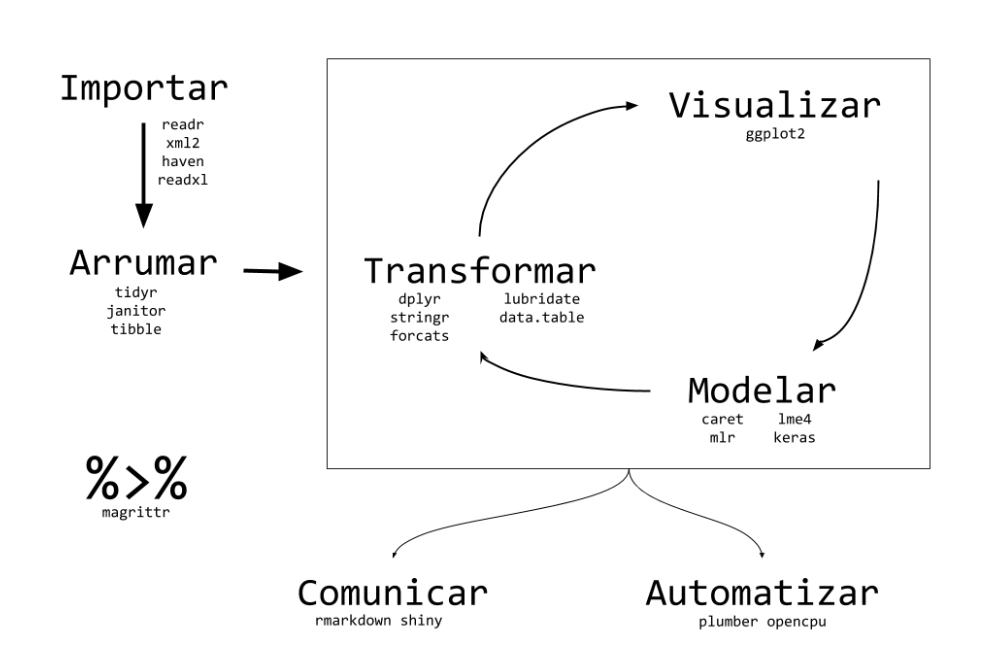
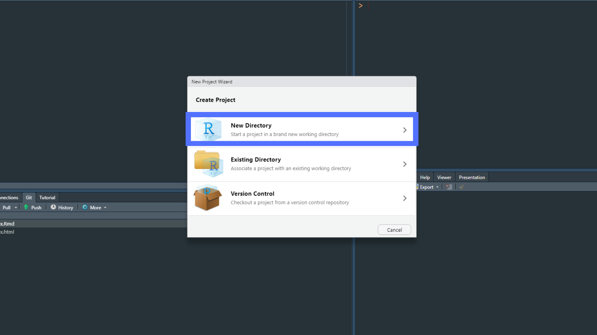
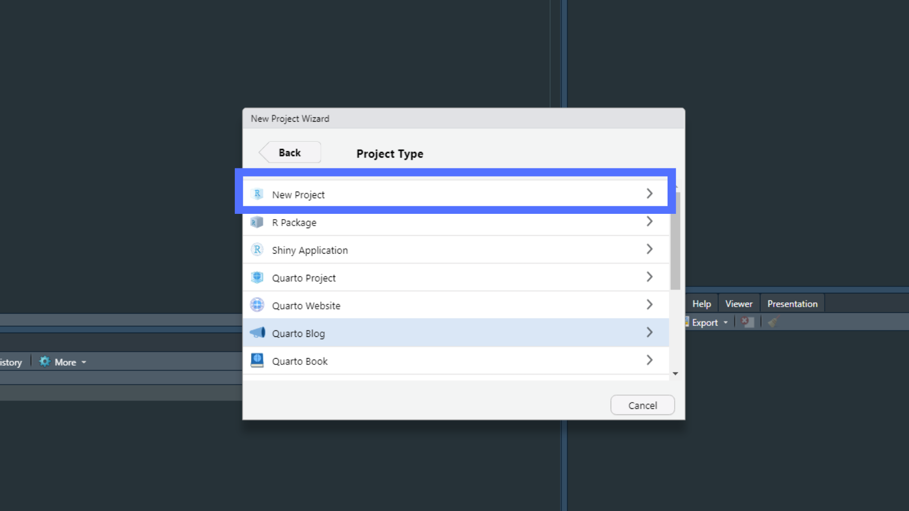
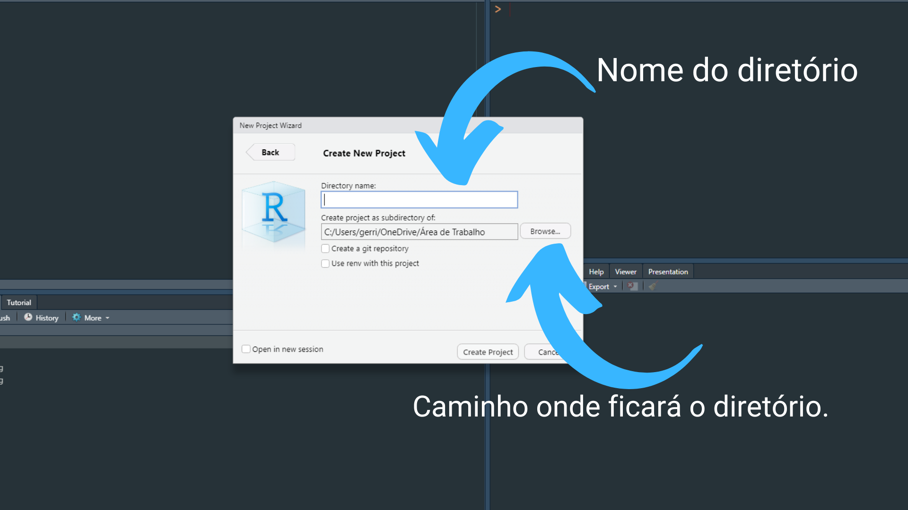
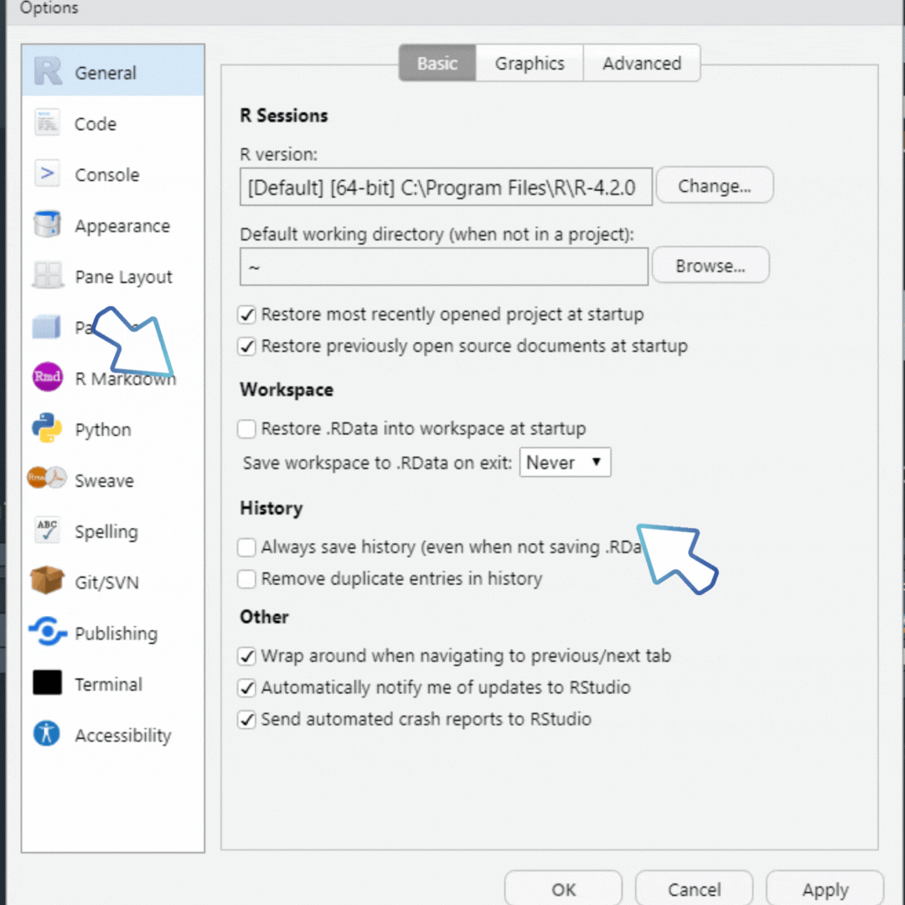

class: center, middle, animated slideInRight fadeOutLeft, animated slideInRight fadeOutLeft

```{r setup, include=FALSE}

knitr::opts_chunk$set(echo = TRUE, message = FALSE,
                      warning = FALSE)

```


```{r xaringan-scribble, echo=FALSE}
xaringanExtra::use_scribble()
```

```{r share-again, echo=FALSE}
xaringanExtra::use_share_again()
```

```{r xaringan-logo, echo=FALSE}
xaringanExtra::use_logo(
  image_url = "ofb.png", 
  position = xaringanExtra::css_position(top = NULL, right = '1em', 
                                         left = NULL, bottom = '1em')
)
```

```{r xaringanExtra-clipboard, echo=FALSE}
xaringanExtra::use_clipboard()

```

```{r xaringan-animate-css, echo=FALSE}
xaringanExtra::use_animate_css(xaringan = FALSE)
```

```{r xaringan-painelset, echo=FALSE}
xaringanExtra::use_panelset()

```

```{r xaringan-extra-styles, echo=FALSE}
xaringanExtra::use_extra_styles(
  hover_code_line = TRUE,         #<<
  mute_unhighlighted_code = FALSE  #<<
)
```

```{r xaringanExtra, echo = FALSE}
xaringanExtra::use_progress_bar(color = "#0051BA", location = "top", 
                                height = "10px")
```


# Introdução

---

# O que é o R?


É uma linguagem de programação de computadores utilizada principalmente
para manipulação de dados e visualização de gráficos. `R` é uma linguagem de código aberto criada em 1993 pelo departamento de Estatística da Universidade de Auckland (pelos estatísticos     **R**oss Ihaka e **R**obert Gentleman), Nova Zelândia, baseada na linguagem `S` (criada por John Chambers Rick Becker e Allan Wilks em 1976, na Bell Labs).

O `R` é escrito principalmente em `C` e `Fortran`, sendo disponível gratuitamente sob a licença GNU General Public e em vários sistemas operacionais como `MAC`, `Windows` e `Linux.`

O `R` usa uma _Integrated Development Environment_ (IDE) própria, com interface não muito amigável. Porém, há algumas interfaces que podem ser integradas ao software que ajudam a melhorar o visual.


---
# Por que usar R?

- _Open Source_:

    - É grátis.
    - Todos podem usar as mesmas ferramentas, independente de condições finaceiras e/ou sociais.
    - Podemos desenvolver nossas próprias ferramentas.
    - Podemos aprimorar ferramentas já disponíveis pela comunidade `R`.

- Linguagem simples e fácil de entender.

- Facilidade em se conectar a linguagens de programação de alto desempenho como `C`, `Fortran` e `C++`.

- Possui grande comunidade, que é diversificada e acolhedora. 

- Muitos pacotes.

- Ferramentas poderosas como `Rmarkdown` e `shiny`.

- Tem a IDE `Rstudio`, que facilita a interação com os dados.


---

# Instalação do R

- Seguir para o [Comprehensive R Archive Network (CRAN)](https://cloud.r-project.org/), que funciona como uma pasta que arquiva vários servidores espelhos distribuídos. No entanto, não precisa você baixar o mais próximo a você, pois o `CRAN` já faz isso automaticamente.  

# Instalação do Rstudio

- `RStudio` é um ambiente de desenvolvimento integrado, ou IDE, para programação R.

- Fazer _download_ e instalar em [RStudio](https://www.rstudio.com/products/rstudio/download/).

- Uso do `R` _online_ por meio do [Rstudio Clound](https://login.rstudio.cloud/).


O passo a passo para instalação em diferentes sistemas operacionais podem ser consultados no _ebook_ da **curso-r** de [Ciência de Dados em R](https://livro.curso-r.com/1-1-instalacao-do-r.html).

---
class: center, middle, animated slideInRight fadeOutLeft, animated slideInRight fadeOutLeft

# Operações Básicas no R

---
```{r}
# Soma
1 + 1 
```

```{r}
# Subtraçao
5 - 2
```

```{r}
# Multiplicação
2 * 2
```

```{r}
# Divisão
 10 / 2
```
---

```{r}
# Potência
10 ^ 2
```

```{r}
# Resto da divisão
 10 %% 3
```


```{r}
# Raiz quadrada
sqrt(100)

```


```{r}
# Exponencial
exp(1)
```

```{r}
# Logaritimo natural
log(1)

```

---
class: center, middle, animated slideInRight fadeOutLeft

# Operadores Lógicos no R

---

```{r}

# Igual
3 == 3

```
- **Obs.:** O  **`=`**  signifitca _atribuição_, assim como  `<-` . No entanto, no `R` é recomendado usar a  **`<-`** .


```{r}
# Diferente
3 != 4

```


```{r}
# Maior que
3 > 3

```


```{r}
# Menor que
3 < 2
```
---

```{r}
# Maior ou igual
3 >= 4

```


```{r}
# Menor ou igual
3 <= 2

```

```{r}
# Está contido em
2 %in% 1:10

```

```{r}
# E
2 < 3 & 3 > 2
```

---

- No console do `Rstudio` é preciso apenas digitar o comando e apertar **Enter**. 

```{r}
1 + 1
1 + 2
```

- O `[1]` está apenas indicando que é o primeiro resultado. Abaixo dar para ver como funciona quando temos mais de um resultado.

```{r}
50:100
```
---

- Comando imcompleto. Aparece um `+` abaixo, indicando que falta o restante do código.


```{r, eval=FALSE}
> 3 - 
 + 
```

- Comando não reconhecido. Retorna mensagem de erro.

```{r, eval=FALSE}
> 3 % 5
Error: unexpected input in "3 % 5"
> 
```

---


```{r, echo=FALSE}

df <- readr::read_rds('df_operacoes.rds')

knitr::kable(x = df, align = 'c', caption = 'Principais Operadores')
```

---
class: center, middle, animated slideInRight fadeOutLeft

# Objetos
---

- O objeto é basicamente um nome que guarda um valor.


- O operador `:` retorna resultados como um vetor.

```{r}
1:5
```
- Esse valor não fica gravado para ser recuperado posteriormente. Logo, vamos criar um **objeto R**.
```{r}
meu_objeto <- 1
```

```{r}
meu_objeto + 2
```

- Outro exemplo de objeto.
```{r}
outro <- 1:5
outro
```


---

- Não usar em nomes de objetos:

    - números (por exemplo, `1teste`)
    - alguns simbolos especiais, como `^`, `!`, `$`, `@`, `+`, `-`, `/`, `*`
    - Palavras reservadas, como por exemplo `if`, `for`, etc.

- `R` é _case-sensitive_ (diferencia minúscula de maiúscula).

```{r}
Nome <- 2

nome <- 0

```
```{r}
Nome + 1
```

```{r}
nome + 1
```

---

- `R` sobrescreve objetos armazenados anteriormente.


```{r}
meu_num <- 10
meu_num 


meu_num <- 900
meu_num

```

- Ver os objetos armazenados.

```{r}
ls()
```

---


## Criando Vetores

```{r}
c(2, 3, 4)

2:4

c('a', 'b', 'c')

c(T, F, T)


```

---

```{r}
seq(2, 5, by = 1)

seq(2, 5, by = 0.5)


rep(1:3, times = 2)

rep(1:3, each =  2)


# Combinando as duas funções
rep(seq(2,3, 0.5), times = 2)


```


---

- Agora temos os dados armazenados na memória do computador.


```{r}

d <- 1:6

# Subtrai 1 de cada elemento de `d`.
d - 1

```

```{r, warning=FALSE, message=FALSE}

d <- 1:6

# soma elemento a elemento
d + 5:10

```

```{r}

# multiplica elemento a elemento 
# (não usa a regra de que o nº de linhas de A deve ser igual ao nº de colunas de B)

d * d

```


---
## Classes dos objetos

- É a partir dela que tomamos deciões sobre o que fazer com os operadores.

```{r, eval=FALSE}

# classe numérica
1 + 1

# classe não numérica
'a' + 'b'

```

```{r}

# objeto
a <- 10

# string (como se chama textos no contexto de programação)
'a'

```

- Para saber a classe de um objeto, usar a função `class`

- As classes mais básicas são **numeric**, **character** e **logical**

---
class: center, middle, animated slideInRight fadeOutLeft

# R Base

---

- A funcionalidade do **`R`** é dividida em vários pacotes:

    - **`R base`** _package_  com as funções fundamentais.

    - Outros pacotes contidos no sistema **`R base`**: `utils`, `stats`, `datasets`, `graphics`, `grDevices`, `grid`, `methods`, `tools`, `parallel`, `compiler`, `splines`, `tcltk`, `stats4`.
    
    - Pacotes "recomendados": `boot`, `class`, `cluster`, `codetools`, `foreign`, `KernSmooth`, `lattice`, `mgcv`, `nlme`, `rpart`, `survival`, `MASS`, `spatial`, `nnet`, `Matrix`.
    

# Manuais Oficiais do R 

.pull-left[

- [An introduction to R](https://cran.r-project.org/doc/manuals/r-release/R-intro.html)

- [R Data Import/Export](https://cran.r-project.org/doc/manuals/r-release/R-data.html)

- [Writing R Extensions](https://cran.r-project.org/doc/manuals/r-release/R-exts.html)

]

.pull-right[

- [R Installation and Administration](https://cran.r-project.org/doc/manuals/r-release/R-admin.html)

- [R Internals](https://cran.r-project.org/doc/manuals/r-release/R-ints.html)

- [R Language Definition](https://cran.r-project.org/doc/manuals/r-release/R-lang.html)

]

---


## Acessar Help


```{r, eval=FALSE}

# Procura documentação da função e seus argumentos

help(mean)
?mean

# Procura pelo nome (string) na documetação do R
help.search('mean')

# Procurar pacote
help(package = 'dplyr')

# Acessar funções do pacote usando `::`

dplyr::select()

```
---


## Usar Pacotes

```{r, eval=FALSE}
# Carregando o pacote
> library(dplyr)
Error in library(dplyr) : there is no package called ‘dplyr’

```


```{r, eval=FALSE}

# Download para baixar pacotes
install.packages('dplyr')

# Carregando o pacote
library(dplyr)

# Usar uma função particular de um pacote
dplyr::select()

# Baixar bases de dados já existentes no R
data(iris)
iris


```
---

## Trabalhando com Diretórios

```{r, eval=FALSE}

# Encontra atual diretório
getwd()

# Modifica o atual diretório
setwd('C:/path/nome_diretorio')

```

- o `R` possui diretório padrão na sua máquina. O qual você descobre usando o `getwd()`.

- Para mudar para um diretório específico, usa-se o `setwd('caminho do novo diretório')`.

- No entanto, o ideal é trabalhar com o conceito de `projetos`, que será abordado em outro momento.

---
## O Ambiente

```{r, eval=FALSE}

# Listar todas as variáveis do ambiente
ls()

# Limpar um objeto do seu ambiente.
# rm() é uma abreviação de remove(x)
rm(x)

# remover todos os objetos do seu ambiente.
rm(list = ls())

# Instalar pacotes
install.packages()

# Remover pacote
remove.packages()

```

---
class: center, middle, animated slideInRight fadeOutLeft

# Introdução a Ciência de Dados

---
## Ciclo de Ciência de Dados

```{r, echo=FALSE, fig.align='center', out.width = '70%'}


```

---
## Criação de Projeto

- **File** `<-` **New Project**

```{r, echo=FALSE, fig.align='center', out.width = '70%'}


```

---

```{r, echo=FALSE, fig.align='center', out.width = '70%'}


```
---

```{r, echo=FALSE, fig.align='center', out.width = '70%'}


```
---

# Criar projeto com pacote `usethis`

```{r, eval=FALSE}
# install.packages('usethis')
# library(usethis)

# Usar a função de criar pacote (lembrar de trocar a barra)

create_project('C:/Users/gerri/OneDrive/Documentos/teste')

```


- <font color="#0000CD">Caso não queira usar projetos, usar a forma menos eficiente</font> `setwd( )`.
---
## Desabilitar o **Restore .RData**:
 
   - **Tools** `->` **Global Options** `->` **General**
   
```{r, echo=FALSE, fig.align='center', out.width = '35%'}


```

- Não mostrará códigos e bases de dados executados anteriormente.

---
class: center, middle, animated slideInRight fadeOutLeft

# Tidyverse

---

## Ver todos os pacotes do `tidyverse`.

```{r, echo=TRUE}
# install.packages('tidyverse')
library(tidyverse)
tidyverse_packages()
```

---
## Importação de Dados com `readr`


```{r, eval=FALSE}
# install.packages('readr')

library(readr) # Para csv e txt.


df <- read_csv(file = "dados/base.csv") # separado por "," 

df <- read_csv2(file = "dados/base.csv") # separado por ";" 

df <- read_delim(file = "dados/base.csv", delim = "|") # seprado por outros delimitadores.


```

 - Os quadros de dados no `tidyverse` retornam no formato de `tibble`, que é uma forma mais sofisticada de um `data.frame` nativo do R. 
 
 - Para dados com larguras fixas (PNAD, por exemplo) usa-se `read_fwf( )`.


---
## Importação de Dados com `readxl`

```{r, eval=FALSE}
# install.packages('readxl')

library(readxl) # Para xls e xlsx.

df <- read_xls("data-raw/base.xls")

df <- read_xlsx("dados/base.xlsx")

df <- read_excel() # para ambos.

```

 - Outros pacotes que são bastante utilizados:
 
   - `data.table` (similar ao `readr`)
   
   - `read.dbc` e `foreign` (microdados do SUS)
   
   - `rgdal` e `sf` (dados espaciais)
   
   - `xml2` (dados do currículo Lattes e wikipedia)

---

## Exemplo:

```{r, eval=FALSE}

# Relação Anual de Informações Sociais (RAIS)
rais <- read_xlsx(path = 'data-raw/df_rais.xlsx')

# Base de Dados da Covid 19
covid <- read_csv('data-raw/caso.csv')

# Pegar online no brail.io (ultimo atualização no site em 2022-03-27)
# url = "https://data.brasil.io/dataset/covid19/caso.csv.gz"
# covid <- readr::read_csv(url)

```


---

## Manipulando e Transformando com `dplyr`

- Algumas das funções do pacote


```{r, echo=FALSE}

readr::read_rds('../data-raw/tab_dplyr.rds') |> data.frame() |> 
  knitr::kable()

```


---

- Aplicando na prática os verbos do `dplyr`:
 
```{r, eval=FALSE}

# Usamos a base de dados de caso.csv (covid) do brasil.io

covid_1 <- mutate(covid, regiao = case_when(
    state %in% c('PA', 'AM', 'AP', 'RO', 'AC', 'TO', 'RR') ~ "NO",
    state %in% c('BA', 'CE', 'PE', 'MA', 'PI', 'SE', 'AL', 'PB', 'RN') ~ "NE",
    state %in% c('SP', 'RJ', 'MG', 'ES') ~ "SE",
    state %in% c('RS', 'PR', 'SC') ~ "SU",
    state %in% c('MS', 'MT', 'GO', 'DF') ~ "CO"))

covid_2 <- rename(covid_1, pop = estimated_population_2019)

covid_3 <- select(covid_2, date, regiao, state, city, place_type, pop, deaths)

covid_4 <- filter(covid_3, regiao == 'NE')

covid_5 <-  group_by(covid_4, state)

covid_6 <- summarise(covid_5, deaths = max(deaths, na.rm = T))

covid_7 <-  arrange(covid_6, deaths)

```
---

# - Uso do pipe `|>` é muito importante para melhorar a eficiência do código.

```{r, eval=FALSE}

covid_1 <- covid |>
  mutate(regiao = case_when(
    state %in% c('PA', 'AM', 'AP', 'RO', 'AC', 'TO', 'RR') ~ "NO",
    state %in% c('BA', 'CE', 'PE', 'MA', 'PI', 'SE', 'AL', 'PB', 'RN') ~ "NE",
    state %in% c('SP', 'RJ', 'MG', 'ES') ~ "SE",
    state %in% c('RS', 'PR', 'SC') ~ "SU",
    state %in% c('MS', 'MT', 'GO', 'DF') ~ "CO")

  )|>
  rename(pop = estimated_population_2019) |>
  select(date, regiao, state, city, place_type, pop, deaths) |>
  filter(regiao == 'NE') |>
  group_by(state) |>
  summarise(deaths = max(deaths, na.rm = T)) |>
  arrange(deaths)


```
---

## Criando uma tabela com o pacote `tibble`


- A função `tibble` permite melhor visualização dos dados no console:

```{r, eval=FALSE}

# Fazer os códigos de UF

cod_uf <- tibble(
  state = c("AL", "BA", "CE", "MA", "PB", "PE", "PI", "RN", "SE"),
  cod_state = c(27, 29, 23, 21, 25, 26, 22, 24, 28)
  ) |> arrange(cod_state)

```

- Uma tabela `tibble` pode ser transformada em `data.frame` e vice-versa. Para isso, usam-se as funções `as.data.frame` e `as_tibble`, respectivamente.

---

- Usando as funções `left_join`, `relocate` e o `across` do pacote `dplyr`

```{r, eval=FALSE}

covid_join <- left_join(covid_1, cod_uf, by = 'state') |>
  relocate(cod_state, .before = state) |>
  mutate(across(.cols = c(cod_state, deaths), .fns =  as.character))

```

- É importante entender o funcionamento dos `*_join`:

```{r, echo=FALSE, fig.align='center', out.width = '35%'}
knitr::include_graphics('figuras/dplyr-joins.png')

```


---


## Arrumando com `tidy`

```{r, eval=FALSE}

# separate
covid_1 <- separate(data = covid, col = date, into = c('ano', 'mes', 'dia'), sep = '-')

# unite
covid_2 <- unite(data = covid_1, col = 'date2', c('ano', 'mes', 'dia'), sep = '-')

# apaga todos os NAs da base
covid_na <- drop_na(data = covid)

# apaga os NAs da coluna city
covid_na <- drop_na(data = covid, city)


```

---

## Pivotagem

- Talvez, as funções mais importantes do pacote `tidyr` sejam `pivot_wider` e `pivot_long`

- Vamos considerar a tabela abaixo:

```{r, echo=FALSE}
# Tabela das mortes por covid19 em duas cidades da região norte do Ceará
readr::read_rds('../data-raw/painel.rds') |> data.frame() |> 
  knitr::kable()

```

---

```{r, eval=FALSE}

# Dados longitudinal para cross-section
d1 <- pivot_wider(data = d, names_from = ano, values_from = deaths, names_glue = 'mortes_{ano}')

```

```{r, echo=FALSE}
# Tabela das mortes por covid19 em duas cidades da região norte do Ceará
readr::read_rds('../data-raw/tab_piv_wider.rds') |> data.frame() |> knitr::kable()

```

```{r, eval=FALSE}

# cross-section para longitudinal
d2 <- pivot_longer(data = d1, cols = c('2020', '2021'), names_to = 'ano', values_to = 'deaths')

```

```{r, echo=FALSE}
# Tabela das mortes por covid19 em duas cidades da região norte do Ceará
readr::read_rds('../data-raw/tab_piv_longer.rds') |> data.frame() |> knitr::kable()

```


---

## Substituindo os `NAs`

```{r, eval=FALSE}

# tibble
tab_3 <- tibble(x = c('A', 'B', 'C', 'D', 'E'),
                y = c(1, NA, NA, 3, NA))

# substituindo NA por ZERO 
replace_na(tab_3, list(y = 0))

# substituindo a coluna completando com os valores existentes
fill(tab_3, y)


```
---
```{r, echo=FALSE, fig.align='center', out.width = '80%'}
knitr::include_graphics('figuras/xau_.gif')

```


